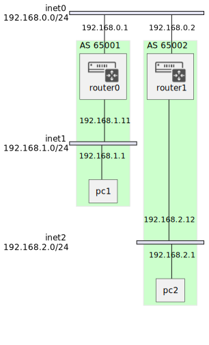

# ネットワーク構成図

## RIP

## v1


RIPv1を使用して動的なルーティングを実装する

## BGP

## Basic

BGPを使った簡単なネットワークを構築する



router1と2でピアを張って経路情報を交換する

## etc

### ブロードキャストストーム

パケットがループしてしまうことで発生する現象をあえて発生させたい。

CPUの使用率などをPrometheusで観察したい。


## memo

### command集

```bash
# plan
terraform plan -no-color > plan.txt
# apply
terraform apply -auto-approve
# destroy
terraform destroy -auto-approve
```
